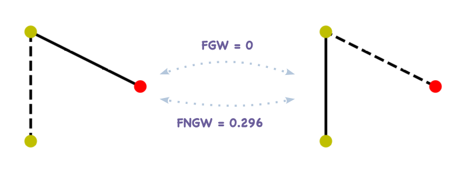
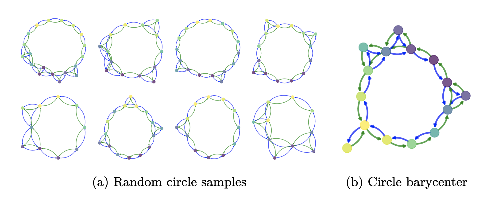

# Fused Network Gromov-Wasserstein Distance
Implementation of the TMLR paper [Exploiting Edge Features in Graph-based Learning with Fused Network Gromov-Wasserstein Distance](https://openreview.net/forum?id=8uCNtJ2Fmo).

> **Attention:** In the paper, we use *E* to denote edge feature tensor, in our code, we use *C* instead for some cases.

## Environment Preparation
Before running the code, please create the following conda environment:
```bash
conda create -n fngw_env python=3.8.13
conda activate fngw_env
pip install POT==0.8.2 \
            numpy==1.24.4 \
            rdkit==2022.3.5 \
            scipy==1.8.1 \
            scikit-learn==1.1.1 \
            joblib==1.1.0 \
            networkx==3.1 \
            matplotlib==3.5.2 \
            torch-geometric==2.1.0.post1 \
            tqdm==4.64.0 \
            pandas==2.0.3 \
            chainer-chemistry==0.7.1
```

## Distance Computation
To compute the fngw distance between two node-featured and edge-featured graphs, please call the following function:
```python
from fngw import fused_network_gromov_wasserstein2
```

<p align="center">

</p>

Here is an simple example of how to compute the FNGW distance between the two above graphs:
```python
from ot.utils import unif, dist
import numpy as np

# Create two graphs
ones_F = np.eye(2, dtype=float)
ones_E = np.eye(3, dtype=float)
F1 = np.array([0, 0, 1])
F1 = ones_F[F1]
A1 = np.array([[0, 1, 1], [1, 0, 0], [1, 0, 0]], dtype=float)
E1 = np.array([[0, 1, 2], [1, 0, 0], [2, 0, 0]])
E1 = ones_E[E1]

F2 = np.array([0, 1, 0])
F2 = ones_F[F2]
A2 = np.array([[0, 1, 1], [1, 0, 0], [1, 0, 0]], dtype=float)
E2 = np.array([[0, 1, 2], [1, 0, 0], [2, 0, 0]])
E2= ones_E[E2]

# Compute FNGW distance
M = dist(F1, F2)
dist = fused_network_gromov_wasserstein2(M, E1, E2, A1, A2,
                                         p=unif(3), q=unif(3),
                                         alpha=1/3, beta=1/3)
print(dist)
# Out: 0.2962962962962963 
```

## Barycenter Computation
Given a set of graphs, to compute the FNGW barycenter between them, please call the following function:
```python
from fngw import fngw_barycenters
```
It should be noted that the number of nodes in the barycenter graph need to be specified. A circle barycenter example can be found in notebook `barycenter_example.ipynb`.

<p align="center">

</p>


## Graph Classification

## Supervised Graph Prediction: Fingerprint to Molecule
### 1. Create dataset
Download the dataset from https://zenodo.org/records/804241#.Yi9bzS_pNhE and put the data into the `Data` directory.
In order to create the **Fin2Mol** dataset of the first Supervised Graph Prediction task presented in our paper, please run the following script:
```bash
cd sgp_fin2mol
python create_data.py
```
Normally, you can find the created input fingerprint and output graph files in the directory `sgp_fin2mol`.


## Supervised Graph Prediction: Metabolite Identification
Edge information should be one of 'type', 'stereo' or 'mix'.
### 1. Create dataset
```bash
cd sgp_metabolite_id
python build_data.py --edge_info=type
```

### 2. Cross validation to choose the parameters
```bash
python cross_validation.py --edge_info=type
```

### 3. Get performance on the test set with the best parameters from the CV
```bash
python test.py --edge_info=type --alpha=0.1 --beta=0.1
```


